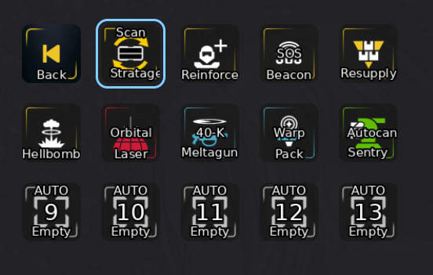
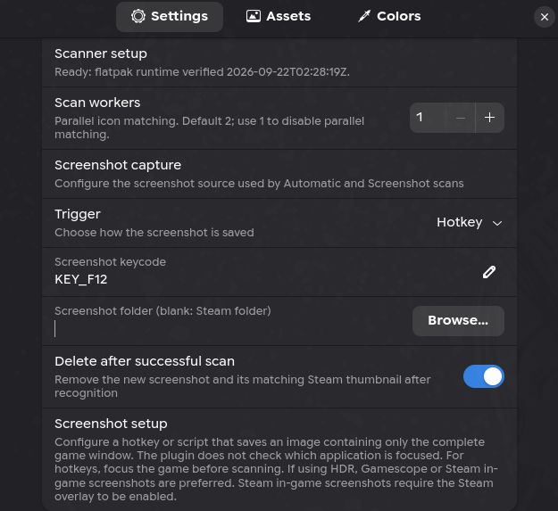

# Automatic Stratagem Detection (Beta)

Automatic stratagem detection reads the stratagems you have equipped in
Helldivers 2 and puts them on your Stream Deck buttons. It is opt-in and off by
default. When you switch it on, it captures images of the game screen, through
Gamescope or your screenshot hotkey, to recognize stratagems.

## Getting started

1. Install the HELLDIVERS 2 plugin from the StreamController store.
2. Open **Settings → Plugins → HELLDIVERS 2** and switch on **Enable automatic
   stratagems**. The scanner prepares itself in the background. The collapsed
   **Automatic stratagem settings** section below the switch shows its status.
   If the runtime needs setup (not yet prepared, or the last attempt failed),
   the section opens itself and **Scanner setup** offers a **Run setup**
   button.
3. Make sure one capture path works:
   - **Steam screenshot (default):** Steam's F12 screenshot key with the Steam
     overlay enabled. The plugin presses F12 for you and reads the new image
     from the game's Steam screenshot folder.
   - **Gamescope:** if you launch the game through Gamescope, the plugin
     captures it directly and needs no screenshot setup.

   Other keys, scripts, and folders are covered in
   [Capture sources](#capture-sources).
4. Drag **Automatic Stratagem Page** onto your deck.
5. In the game, open the stratagem selection screen or expand the in-mission
   stratagem menu, then tap the button. It scans the screen and opens a page
   filled with your stratagems. Tap one to call it; tap **Back** to return.

   

Your ordinary stratagem buttons keep working whether or not this feature is on.

## Using it

- **The generated page.** The first tap on **Automatic Stratagem Page** scans
  and creates the page. Later taps reopen it without scanning. Hold the button
  to scan again and replace the page.
- **Fixed slots on your own page.** Add **Automatic Stratagem Scanner** and
  several **Automatic Stratagem** buttons to any page. Tap the scanner to fill
  the Automatic Stratagem buttons. Give a button an **Automatic slot** number
  to pin a position, or a **Color filter** (Any, Red, Blue, Green, Yellow) so
  it only takes stratagems of that icon color.
- **Rescanning.** Tap an empty Automatic Stratagem button to scan, or hold any
  Automatic Stratagem button to rescan. Hold the scanner to clear the page's
  assignments. Hold the page button to regenerate its page.
- **Selection screen or mission menu.** Scan the loadout selection screen
  before a mission, or the expanded stratagem menu during one. The plugin
  never opens either screen for you, so open it before scanning.

Button details are in [Actions](#actions).

## Manual install

StreamController runs the plugin's `__install__.py` only for plugins it
installs itself, including custom entries under **Settings → Store → Custom
Plugins**, which accept a repository URL and branch. A plugin directory copied
or cloned by hand never runs it.

Requirements beyond the store install:

- **Native StreamController:** a C compiler and Linux kernel headers, because
  `evdev` publishes no wheels and is built during setup.
- **Screenshot hotkey:** write access to `/dev/uinput`. Ordinary stratagem
  buttons need the same access.

Switching the feature on still prepares the runtime. After copying or
updating the plugin by hand with the feature already on, **Run setup** may be
hidden, because the row trusts the last recorded outcome. Switch the feature
off and on again, or run the hook once from the installed plugin directory
with the interpreter that runs StreamController:

```sh
# Flatpak StreamController
PLUGIN_ROOT="$HOME/.var/app/com.core447.StreamController/data/plugins/net_jslay_helldivers_2"
flatpak run --command=/usr/bin/python3 com.core447.StreamController \
  "$PLUGIN_ROOT/__install__.py"
```

```sh
# Native StreamController, using its own interpreter
PLUGIN_ROOT=/path/to/installed/plugins/net_jslay_helldivers_2
/path/to/StreamController/venv/bin/python "$PLUGIN_ROOT/__install__.py"
```

The hook prepares nothing unless the feature is switched on, and always exits
successfully so a failed preparation cannot fail a plugin install. It reports
what it did on standard output and records the same outcome in ignored
`automatic_stratagems/runtime/setup-status.json`.

`automatic_stratagems/tools/setup-runtime` drives the Flatpak profile
explicitly, including offline artifacts and rollback:

```sh
flatpak run --command=/usr/bin/python3 com.core447.StreamController \
  "$PLUGIN_ROOT/automatic_stratagems/tools/setup-runtime" \
  --root "$PLUGIN_ROOT" setup
flatpak run --command=/usr/bin/python3 com.core447.StreamController \
  "$PLUGIN_ROOT/automatic_stratagems/tools/setup-runtime" \
  --root "$PLUGIN_ROOT" check
```

- `setup` downloads hash-pinned sources when absent, validates real imports
  and OCR, then atomically activates the new profile
- add `--artifact-dir DIR --offline` after `setup` to use sandbox-accessible
  downloaded sources
- replace `check` with `rollback` to verify and activate the previous profile
- generated profiles and downloads live in ignored
  `automatic_stratagems/runtime/`

## Advanced overview

### Capture sources

Each scan button has a **Capture source**:

- **Automatic** (default): try Gamescope first, then Screenshot if Gamescope
  fails or recognition is incomplete. Keep the Gamescope result if the
  fallback recognizes no more stratagems
- **Gamescope:** capture only the uniquely associated Helldivers Gamescope
  session
- **Screenshot:** use the shared screenshot settings directly

For why other capture backends were dropped, see
[removed and unbuilt backends](docs/architecture.md#removed-and-unbuilt-backends).

Helpers each source needs:

- native Gamescope: host `gamescopectl` and a uniquely associated Helldivers
  Gamescope session
- Flatpak Gamescope: Steam's matching
  `org.freedesktop.Platform.VulkanLayer.gamescope` extension and host
  `flatpak`; live compatibility is **unverified**
- Screenshot hotkey: `evdev`, access to `/dev/uinput`, and a shortcut that
  saves an image
- Screenshot script: an executable script readable from the sandbox and
  runnable on the host
- native optional mission-name fallback: Tesseract with English data; Flatpak
  setup supplies and requires its locked OCR payload

### Plugin settings

All in **Settings → Plugins → HELLDIVERS 2**:



- **Enable automatic stratagems:** the feature switch, off by default. Every
  other automatic setting sits in the section below it and is unavailable
  while the switch is off
- **Automatic stratagem settings** (collapsed): its subtitle shows the scanner
  setup status. It opens itself when setup needs action; once the runtime is
  verified it stays open or closed as you leave it. Inside:
  - **Scanner setup:** the last preparation result, with **Run setup** when
    the runtime is not prepared or the last attempt failed
  - **Scan workers:** recognition parallelism, 1–32, default 2. Lower it on
    memory-constrained systems; capture and key input stay serialized
  - **Screenshot capture:** a heading for the screenshot rows that follow
  - **Trigger:** Hotkey (default) or Script
  - **Screenshot keycode:** `KEY_F12` by default. For a chord, join evdev key
    names with `+`, such as `KEY_LEFTCTRL+KEY_F12`
  - **Absolute screenshot script path:** one absolute executable path that
    saves the screenshot and exits. Arguments and shell commands are not
    accepted
  - **Screenshot folder (blank: Steam folder):** leave empty for the
    Helldivers Steam screenshot folder, or browse for a folder. Choose
    explicitly if several Steam accounts have captures
  - **Delete after successful scan:** on by default; removes the new image
    and, for Steam screenshots, its exact matching thumbnail

Screenshot rules:

- The folder and script must be readable from StreamController's sandbox.
  Typing a path grants no access
- The hotkey or script must save an image containing only the complete game
  window. The plugin does not check which application is focused, so focus
  the game before a hotkey scan
- With HDR, prefer Gamescope or Steam in-game screenshots. Steam in-game
  screenshots require the Steam overlay
- The scanner accepts one stable new or changed PNG or JPEG directly inside
  the folder. Ambiguous captures, symlinks, and incomplete images are rejected
- Keep the folder within 4,096 entries
- Scripts should write under a temporary name and rename the completed image
  into place
- Each hotkey or script capture proves freshness from its own before-and-after
  folder snapshot; GUI actions do not share last-image history

All buttons, including generated pages, use the current plugin screenshot
settings; per-button screenshot paths and triggers are no longer used. A
generated page inherits its capture source from the button that created it.
Changing shared settings cancels active scans and invalidates stale capture
bindings. Group and page behavior stay the same, and failed replacement scans
preserve saved screenshot-backed pages.

### Gamescope inside Flatpak Steam

Flatpak Gamescope support is **implemented but not live-verified**. It uses
the same Gamescope choice; Automatic can fall back to Screenshot when capture
fails.

Install the Gamescope extension matching Steam's Freedesktop runtime branch
and launch the game through it, typically `gamescope -- %command%`. The
extension supplies `gamescopectl` inside Steam's sandbox. See the
[extension documentation](https://github.com/flathub/org.freedesktop.Platform.VulkanLayer.gamescope)
for setup and compatibility-tool limitations.

- The scanner identifies the game's Gamescope sandbox and invokes its capture
  CLI through `flatpak enter`. This needs unprivileged namespace entry and a
  writable Steam cache with a verified mapping inside its sandbox
- Missing access or ambiguous process or socket identity makes capture fail.
  The plugin does not change Flatpak permissions or request root access
- Flatpak normally hides another application's private cache, including
  Steam's, even with home-directory access. A bounded host file operation
  waits for the new capture and copies its encoded bytes into
  StreamController's shared job directory. It does not decode or process the
  image
- Temporary-file cleanup uses the recorded file and directory identities. If
  cleanup cannot be confirmed, the scan stops without Screenshot fallback and
  keeps its job directory and `steam-capture.json` recovery record
- A forced application exit can also leave temporary files; there is no
  automatic recovery sweep

Live capture, HDR output, Steam/Proton compatibility, and cleanup in this
setup remain unverified. Fixture and dummy-command tests do not establish
those.

### Flatpak process split

Recognition, worker pools, Tesseract, hotkey input, accessible screenshot
polling, caching, and diagnostics stay inside StreamController's Flatpak. The
bounded host runner invokes native Gamescope capture, minimal
process/socket/file operations, and user-selected screenshot scripts. For
Flatpak Gamescope it invokes the capture CLI inside the identified Steam
sandbox through `flatpak enter`. Host scripts are ordinary executable
programs, so choose scripts you trust. No host Python recognizer is required.

Host transport requirements:

- Flatpak: sandbox `flatpak-spawn`, session-bus access to
  `org.freedesktop.Flatpak`, host `/usr/bin/grep`, `/usr/bin/mv`,
  `/usr/bin/rm`, `/usr/bin/sh`, `/usr/bin/sleep`, and `/usr/bin/sync`, plus
  readable host `/proc` uptime and process metadata
- Gamescope: host `/usr/bin/python3` for bounded identity and file-mapping
  checks. For Flatpak Gamescope, those checks guard entry into the selected
  sandbox before invoking its capture CLI. Host Python never runs recognition
  or OCR
- Native StreamController: `/usr/bin/setsid` to isolate and reap capture
  commands

Process ownership:

- Each host command, its descendants, watchdog, and guard share one owned
  process group. The guard writes durable `ready` and `result` markers, then
  kills that group
- A separate bounded host query must prove the group has no non-zombie members
  before the parent records `complete`. A result alone is not cleanup proof
- Queries retry on unknown state, and input ownership stays held while cleanup
  is unconfirmed. Gamescope host metadata verifies process/socket association
  and shared paths
- If a launcher dies after submission but before `ready`, the parent waits for
  the absolute shared-kernel deadline, then requires an exact host
  nonce-absence query. A request delivered after that query refuses to launch
  because it is expired. This rare path can hold input for the rest of the
  120-second scan limit
- Clock, query, or ownership-state errors keep cleanup unknown beyond that
  limit

### Runtime details

Switching the feature on prepares the scanner runtime in the background.
Nothing is installed while the feature is off.

- **Flatpak:** downloads and verifies the locked OCR payload, and validates
  the sandbox-provided NumPy 2.2.3, OpenCV 4.11.0, Pillow 11.1.0, and evdev
  1.9.1 rather than copying a host Python environment
- **Native:** builds `automatic_stratagems/.venv` with StreamController's own
  interpreter and installs the pinned `automatic_stratagems/requirements.txt`
  into it. This environment belongs to the feature and is rebuilt whenever it
  cannot be verified. The repository's root `.venv` is a separate developer
  environment for the asset updater and tests

When preparation runs:

- from `__install__.py` after every store install and update, before the
  plugin loads, whenever the feature is already on. An update replaces the
  plugin directory, so the runtime is rebuilt then
- from the settings switch and **Run setup**, which records the outcome in
  ignored `automatic_stratagems/runtime/setup-status.json`. The **Scanner
  setup** row reads only that record, so it offers **Run setup** while the
  feature is on and the record is missing, failed, or unrecognized, and hides
  it once the runtime is verified or while preparation runs
- from a scan whose setup check fails for any reason, including a missing
  capture command. The scan prepares the runtime instead of scanning and asks
  for another scan. That preparation holds the shared input lock until it
  finishes, so no scan can start meanwhile
- never at plugin startup

Preparation cannot be cancelled, a native pip install can take up to 30
minutes, and shutdown does not wait for it.

The Flatpak profile's 11.1 MB locked payload contains:

| Component | Purpose | Payload | License |
| --- | --- | ---: | --- |
| Tesseract 5.5.0 and English `tessdata_fast` 4.1.0 | mission-name fallback | 4.17 MB | Apache-2.0 |
| libtesseract 5.5.0 and Leptonica 1.86.0 | OCR engine and image library | 6.91 MB | Apache-2.0 and BSD-2-Clause |

License notices are kept in each generated profile. The smaller English
`tessdata_fast` model keeps the payload bounded; its OCR results can differ
from native system models. Native installs keep their existing optional
Tesseract and English data. Neither profile changes recognition thresholds.

### Validated setups

- Live checks covered Steam F12 and native Gamescope on StreamController
  1.5.0-beta.15 Flatpak, Hyprland, GNOME 50, x86_64, CPython 3.13, and the
  English game UI at 5120×2160
- The configurable trigger workflow still needs its own live desktop
  verification. Fixture tests do not establish support for every screenshot
  shortcut or script
- The calibrated recognition profile is the English UI at 5120×2160. Included
  fixtures cover known screens and bounded geometry changes. They do not
  certify other resolutions, aspect ratios, HUD settings, HDR pipelines,
  unseen multiplayer layouts, or gameplay conditions
- Ambiguous observations stay unknown
- Cold recognition can use several GiB of memory; low-memory hosts are not
  validated
- Flatpak Gamescope is unverified live; see
  [Gamescope inside Flatpak Steam](#gamescope-inside-flatpak-steam)

### Actions

Pick an action by where the stratagems should go:

- **Automatic Stratagem Page:** one button that scans and opens its own
  generated page, with nothing to lay out
- **Automatic Stratagem Scanner** with **Automatic Stratagem** buttons: fill
  slots on a page you design. The scanner scans and assigns; each Automatic
  Stratagem button holds one assignment and calls it when tapped
- **Automatic Stratagem** buttons on their own also work: tapping an empty one
  scans its group

To fill an existing page, give the scanner and its slots the same **Scan
group** and leave **Automatic slot** at `-1` for automatic numbering.

| Action | Tap | Hold |
| --- | --- | --- |
| **Automatic Stratagem Page** | Scan, create, and open a page when no cache exists; otherwise reopen it without scanning | Scan and open a replacement cache |
| **Automatic Stratagem Scanner** | Replace assignments for the current page and group | Clear assignments for the current page and group |
| **Automatic Stratagem** | Execute an assignment, or scan its group when empty | Scan its group, assigned or empty |
| **Back** | Return to the source and keep the generated page | None |

- A generated page holds **Back**, a scanner, and Automatic Stratagem buttons
  on the remaining keys. It needs a deck with at least three keys
- A **+** on Automatic Stratagem Page marks a missing cache; the plain icon
  marks an existing cache
- Back keeps the cache across app restarts and stays available while
  automatic scanning is disabled. Back is generated with the page and hidden
  from the action chooser
- Only the button that starts a scan animates or shows a failure triangle.
  Page and scanner buttons keep the center label blank
- A question-mark badge on an empty Automatic Stratagem slot means the latest
  completed scan was partial
- Unconfirmed badges mean the latest scan did not confirm a previous
  assignment; tapping still executes it. Badges do not show cooldown state.
  Check uncertain assignments before use and rescan the intended menu when
  needed
- Button settings explain the current assignment and uncertainty in text
- A tap rejected while input is busy gives brief feedback on that button only
- Existing **Automatic Stratagem Scanner** buttons configured for the former
  new-page mode keep compatible page-opening behavior

### Slots and groups

- Leave **Automatic slot** at `-1` to allocate unique positive numbers in
  stable page order. Explicit slots (1–99) are reserved first. Moving a button
  may change its automatic slot and gives an Automatic Stratagem Page button a
  new cache
- **Scan group** (default `default`) matches exactly within the same deck and
  page. Finish a group edit with Apply, Enter, or leaving the field; typing
  alone does not change assignments or cancel a scan
- Assignments, scans, and clears apply only to that deck, page, and group.
  Use separate groups for independent sets of slots on one page, each with its
  own scanner
- Creating a generated page seeds it from the scan without changing the
  source page. Later scans and clears on either page do not change the other
  page's assignments
- **Color filter** (Any, Red, Blue, Green, Yellow) fills a slot only with a
  stratagem whose icon has that color, and leaves uncertain matches empty. For
  example, keep red orbital and Eagle strikes in one row and green sentries in
  another
- Each Automatic Stratagem Page button owns a separate cache, even when
  several use the same group. Holding one leaves other page caches and source
  assignments unchanged

Regenerating a page always keeps the old page if setup fails. After that:

- **Gamescope** deletes the cache after a successful preflight and before
  capture, so a later capture or recognition failure leaves no replacement
- **Automatic** and **Screenshot** keep the old page until a successful
  replacement is ready

Correct the error and tap or hold again to retry.

### Privacy and deletion

- Routine scans keep no diagnostic screenshots
- **Delete after successful scan** applies only after successful recognition,
  and only to newly created files that still match the captured identities.
  Existing, overwritten, failed, or cancelled captures are kept
- Steam cleanup pairs the main image with its same-name file inside
  `thumbnails/`; uncertain or incomplete pairs are kept. Steam's screenshot
  index is not edited
- Turn deletion off to keep screenshots

## Troubleshooting

- **Automatic actions are absent:** enable the feature, then reopen the action
  chooser. If setup is incompatible, ordinary actions stay available.
- **Scan fails immediately:** open the initiating button's settings and read
  **Last scan**. A first failure caused by a missing runtime prepares it and
  asks for another scan. Otherwise read **Scanner setup** in the plugin
  settings, press **Run setup** if it is shown, and check the selected
  source's helpers.
  Flatpak users can run the setup tool's `check` command, then `setup` or
  `rollback` when the active profile is invalid. A page button keeps its
  latest attempt separately from source-page assignments; the attempt is not
  kept across app restarts.
- **Preparation fails while downloading:** the locked Flatpak sources come
  from snapshot.debian.org, which throttles repeated requests, so one attempt
  can report a download failure. Verified downloads are kept in
  `automatic_stratagems/runtime/downloads/`, so **Run setup** again resumes
  from them.
- **Automatic position unavailable:** the host page structure could not
  resolve this button's position. Automatic slots stop rather than sharing
  slot 1; explicit positive slots stay usable.
- **Partial result:** one or more rows were unknown, unconfirmed, or reported
  as partial. Check uncertain assignments and scan the intended game screen
  again. Capacity overflow alone does not make a scan partial.
- **Steam capture fails:** check `/dev/uinput` access, the configured keycode,
  and the Steam overlay. Steam creates the screenshot in its folder; safe
  cleanup removes it and its thumbnail when deletion is on.
- **Flatpak transport fails:** the current scan retries cleanup checks and
  blocks new input until cleanup is confirmed. Restore the named helper,
  `/proc`, or session-bus access while the app keeps running. A submitted
  command without `ready` can hold input for up to 120 seconds; unavailable
  metadata or malformed state can keep it blocked longer. A result, wrapper
  exit, or restart does not reconcile an old host-job registry.
- **Back cannot find its source:** the generated page stays recoverable
  rather than switching to an unrelated page.
- **Disabling the feature:** cancels scans and blocks automatic actions while
  keeping configured buttons, caches, and assignments.

## Replay, diagnostics, and tests

These commands use the root developer `.venv`. Install
`automatic_stratagems/requirements.txt` into it as well as
`update/requirements.txt`, since replay and tests import the scanner.

Replay a saved image through the same recognizer the plugin uses:

```sh
.venv/bin/python -m automatic_stratagems.scanner \
  --image /path/to/capture.png --json
```

Add `--debug-dir /private/path` for explicit troubleshooting artifacts. Review
raw captures before sharing and keep them out of Git.

### Evaluate a screenshot collection

Keep full-scene captures in a private directory. Prepare a manifest beside
that directory, then fill in each case's provenance, split, detected mode, and
ordered expected catalog IDs (`null` for an unknown row):

```sh
.venv/bin/python automatic_stratagems/tools/fixture-manifest prepare \
  /private/evaluation/captures --output /private/evaluation/manifest.json
# Edit the incomplete manifest before validation.
.venv/bin/python automatic_stratagems/tools/fixture-manifest validate \
  /private/evaluation/manifest.json
.venv/bin/python automatic_stratagems/tools/evaluate-fixtures \
  /private/evaluation/manifest.json --split heldout \
  --output /private/evaluation/results.json
```

- Use `calibration` for screenshots used to tune recognition. Reserve
  `heldout` for independently labeled captures never used for tuning
- Evaluation checks hashes, dimensions, labels, provenance, and known overlap,
  then runs each selected image through the scanner without caching
- Results compare detected mode and ordered IDs, including unknown rows;
  mismatches return a failing status. Hash checks alone cannot establish
  independence
- Tools leave source images untouched, refuse to overwrite output files,
  never capture the desktop, and add nothing to Git
- Full scenes may contain private information; review and curate them before
  sharing

See the [manifest contract](docs/architecture.md#offline-fixture-evaluation)
for required metadata, limits, and the difference between calibration and
held-out captures.

### Test commands

Run the feature and ordinary key-mapping regressions:

```sh
.venv/bin/python automatic_stratagems/tools/check
```

Check that the install hook, runtime provisioning, and host scripts import
only the standard library:

```sh
python3 automatic_stratagems/tools/check-imports
```

Replay every calibrated mission panel across the supported x offsets, to check
that translation does not change detection:

```sh
.venv/bin/python automatic_stratagems/tools/check-translations
```

Results default to `/tmp/hd2-mission-translation-results.json`; pass
`--output` for another path. `check-sandbox --translations` below runs the
same tool inside the Flatpak boundary.

Validate the Flatpak boundary with isolated data and saved fixtures:

```sh
python3 automatic_stratagems/tools/check-sandbox \
  --artifact-dir /path/to/runtime/downloads \
  --fixture-manifest /private/calibration/manifest.json \
  --fixture-case mission.png \
  --full-suite --translations --calibration --benchmark
```

- Use downloaded artifacts from `setup-runtime` and a curated 5120×2160
  English mission fixture with a known OCR fallback
- The tool stages a separate plugin copy in the app cache, uses offline setup,
  and substitutes fixture bytes for capture
- It checks generated-page completion, cancellation, host descendants,
  input-lock release, and actual sandbox OCR execution
- Results include source hashes, process locations, replay outputs, and
  cache-cold and cache-warm timing and memory
- It does not change the installed plugin or send game input, and does not
  establish live desktop or hardware support

Run the separate **required transport gate** on the host when changing
Gamescope namespace entry or host-command ownership:

```sh
HD2_RUN_FLATPAK_ENTER_TRANSPORT=1 .venv/bin/python -m unittest -v \
  automatic_stratagems.tests.test_flatpak_enter_transport
```

- Starts disposable command-only StreamController Flatpaks and harmless dummy
  commands
- Verifies success, timeout, cancellation, output overflow, wrapper death,
  descendant reaping, and the target sandbox's survival
- Needs the installed StreamController Flatpak and session-bus access
- Neither `check` nor `check-sandbox` runs this gate automatically.
  Unavailable prerequisites are **BLOCKED**, and a skipped test is not
  transport evidence
- It does not capture the screen, inject input, restart the app, or verify
  real Flatpak Steam and Gamescope

See [Architecture](docs/architecture.md) for component boundaries,
persistence, process ownership, and extension points.

## Credits

Automatic stratagems was designed and built by Ty Smith
([@tyvsmith](https://github.com/tyvsmith)), who maintains `automatic_stratagems/`.
